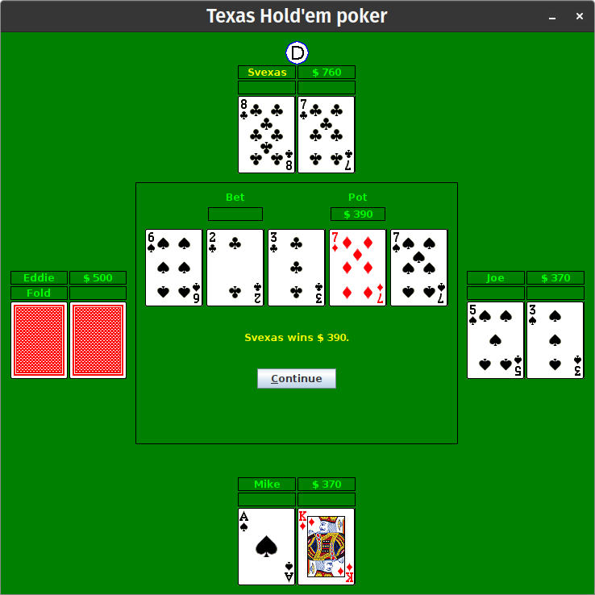

<h1 align="center">Svexas Holdem</h1>
<p align="center"><i>
    Svexas Holdem is an open source poker game.
    <br/>
    It supports both single player and multiplayer modes and is built in Java.  
    <br/>
    This project is a simulation of legacy code with the purpose of improving it and its testability.
</i></p>


<!-- ABOUT THE PROJECT -->
## About The Project



Svexas Holdem will most likely not win an award for the best GUI.
However, it is a great project to learn about legacy code and how to improve it.
We based this project on the open source poker game
[Texasholdem-Java](https://code.google.com/archive/p/texasholdem-java/) by Oscar Stigter and added features to it.


### Improvements include:
* Multiplayer mode
* Improved GUI
* Improved testability
* Improved test coverage
* Bug fixes


<!-- GETTING STARTED -->
## Getting Started

To get a local copy up and running follow these simple steps.

### Prerequisites
* Java 21 or higher
* Gradle 8.5 or higher
* Git


### Installation

#### Installation from source

1. Clone the repo
   ```sh
   git clone https://github.com/JakobEdvardsson/SvexasHoldem.git
   ```
2. Change directory
   ```sh
   cd SvexasHoldem
   ```
3. Start the Server (optional, only if you want to play multiplayer)
   ```sh
   gradle runServer
   ```
4. Start the Client (One for each player, if you want to play multiplayer)
   ```sh
   gradle runClient
   ```


#### Installation from latest release

1. Install the latest release from the [releases page](https://github.com/JakobEdvardsson/SvexasHoldem/releases/)
2. Unzip the file
3. Start the Server (optional, only if you want to play multiplayer)
   ```sh
   java -jar server<version>.jar
   ```
4. Start the Client (One for each player, if you want to play multiplayer)
   ```sh
    java -jar client<version>.jar
    ```

## Origin

This project is fork of [texasholdem-java](https://code.google.com/p/texasholdem-java/) by Oscar Stigter